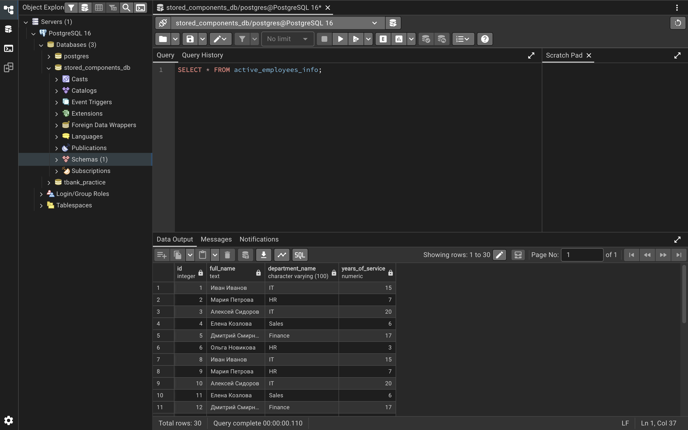
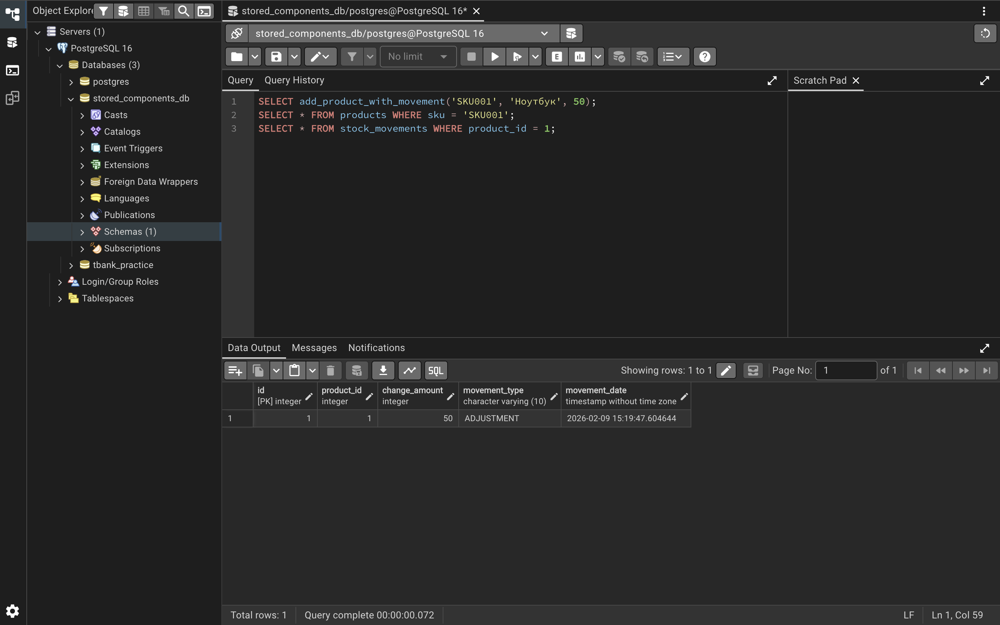
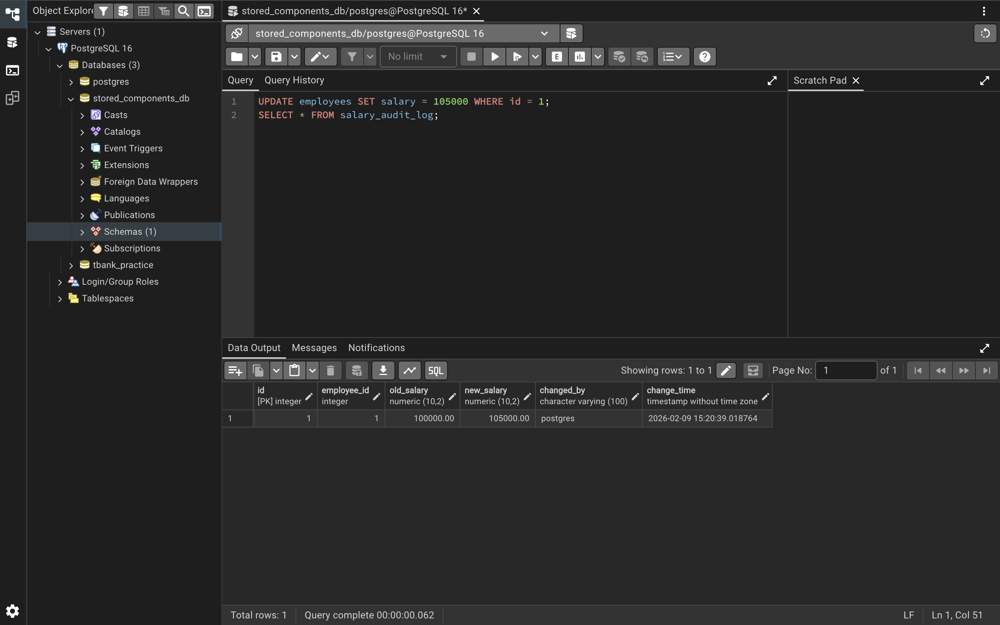
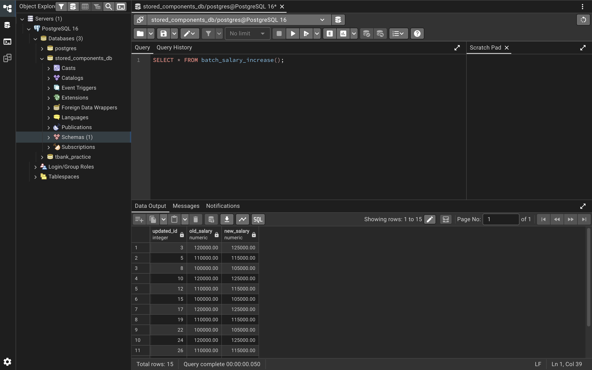

# Содержимое репозитория

| Файл | Описание |
|------|--------|
| `setup.sql` | Создание всех таблиц |
| `view.sql` | Представление `active_employees_info` (отдел кадров) |
| `function.sql` | Функция `add_product_with_movement` (складской учёт) |
| `trigger_salary.sql` | Триггер `log_salary_change` (аудит зарплаты) |
| `cursor.sql` | Курсор `batch_salary_increase` (пакетное повышение зарплаты) |
| `audit_jsonb.sql` | Триггер `audit_data_changes` (полноценный аудит с JSONB) |

## Результаты выполнения

### 1. Представление `active_employees_info`

### 2. Функция `add_product_with_movement`

### 3. Триггер аудита зарплаты

### 4. Курсор для пакетной обработки

### 5. Полноценный аудит с JSONB

Все компоненты протестированы в pgAdmin. Работает корректно.
